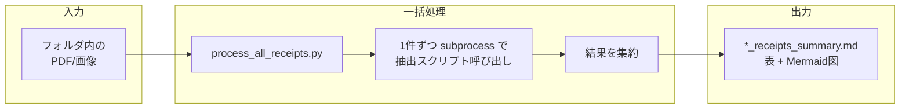
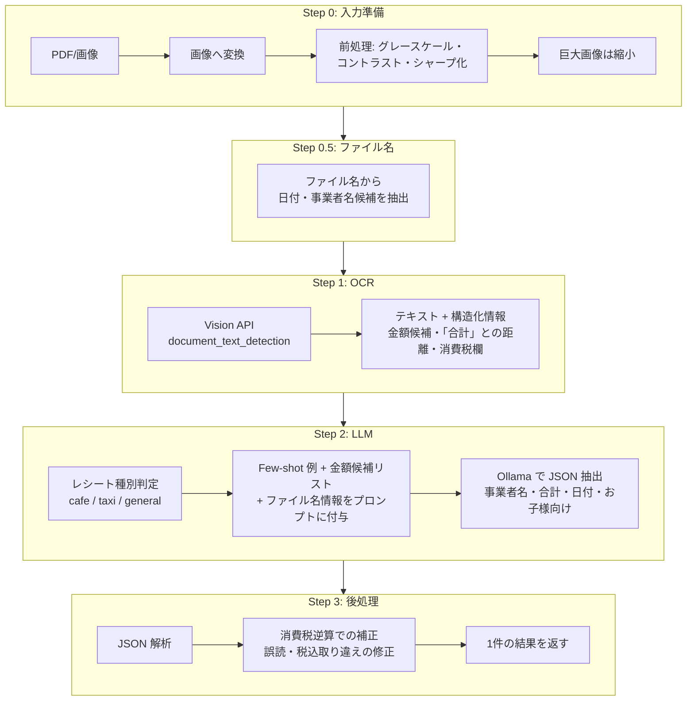
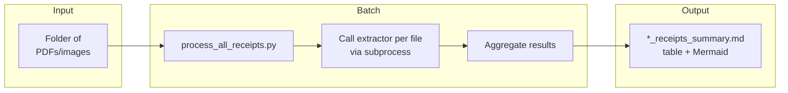
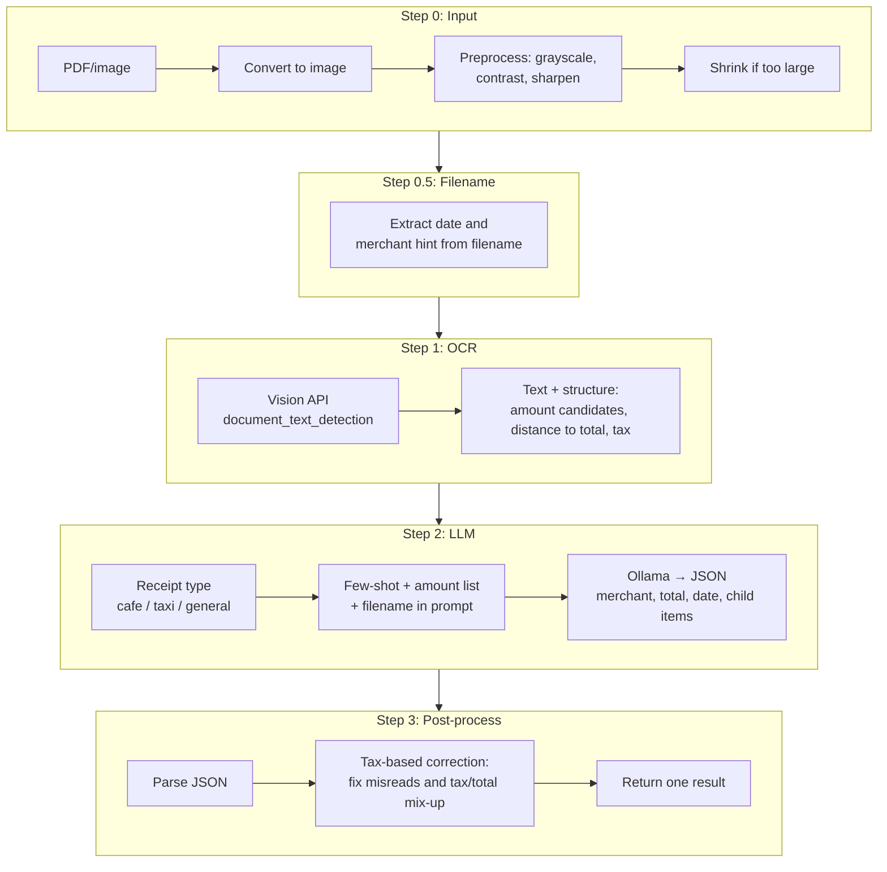

[日本語](#ja) | [English](#en)

---

<a id="ja"></a>
# レシート OCR 一括処理

レシートの PDF/画像を **Google Cloud Vision API** で OCR し、**Ollama** で事業者名・金額・日付を抽出して Markdown 表にまとめるツールです。

## リポジトリの構成

| ファイル | 役割 |
|----------|------|
| `process_all_receipts.py` | 一括処理の入口。指定フォルダ内の PDF/画像を列挙し、1件ずつ抽出スクリプトを呼び出して結果を集約する |
| `google_vision_ollama_prompt_only.py` | 1件ごとの処理。Vision API でテキスト取得 → Ollama で構造化（金額・事業者名・日付） |
| `requirements.txt` | Python 依存パッケージ（google-cloud-vision, Pillow, PyMuPDF 等） |

## 処理の流れと特徴

### 全体の流れ

一括処理では、指定フォルダ内の PDF/画像を **1件ずつ** サブプロセスで抽出スクリプトに渡し、得られた JSON（事業者名・金額・日付など）を集約して Markdown 表と Mermaid 図を出力します。



### 1件あたりの処理（特徴的な部分）

OCR は **Google Cloud Vision API**、その後の「どの金額が合計か」「事業者名・日付」の解釈は **Ollama**（ローカル LLM）で行います。**OCR の生テキストをそのまま LLM に渡すのではなく**、事前に抽出した「金額候補」「合計との距離」「消費税欄」などの **構造化情報** とルールをプロンプトに含めることで、精度と安定性を上げています。



- **画像前処理**: グレースケール化・コントラスト強調・シャープ化で OCR 精度を向上。極端に大きい画像は Vision API 送信前に縮小。
- **ファイル名の活用**: `20250301_店名.pdf` のようなファイル名から日付・事業者名候補を取り、プロンプトに渡して LLM の判断材料にします。
- **金額の構造化**: OCR 結果から「金額らしい数字」を列挙し、**「合計」キーワードとの距離** でソート。お預かり・おつりは除外し、候補だけを LLM に渡します。
- **レシート種別**: ファイル名に「カフェ」「タクシー」などが含まれると、種別に応じた Few-shot 例でプロンプトを切り替えます。
- **消費税まわりの補正**: 消費税額から税込を逆算した候補と OCR の消費税欄を照らし、LLM の返却が「消費税と取り違えた」場合や先頭桁誤読（例: 74,900→4,900）を検知して補正します。
- **お子様向け商品**: キーワードでお子様向け商品を検出し、合計から除外した金額（`total_excluding_children`）も出力します。

## 必要な環境

- **Python 3.10+**
- **Google Cloud** のプロジェクトで Vision API が有効で、認証情報（ADC）を設定済み
- **Ollama** がローカルで起動しており、使用するモデル（例: `gemma3:12b`）を pull 済み

## 1. 依存関係のインストール

```bash
python3 -m venv .venv310
source .venv310/bin/activate   # Windows: .venv310\Scripts\activate
pip install -r requirements.txt
```

## 2. Google Cloud 認証（ADC の設定）

スクリプトは **Application Default Credentials (ADC)** で Vision API にアクセスします。次のいずれかで設定してください。

### 方法 A: サービスアカウント鍵 JSON（推奨・本番・CI）

1. [Google Cloud Console](https://console.cloud.google.com/) → プロジェクト → **IAM と管理** → **サービス アカウント**
2. サービス アカウントを作成し、**キー** → **鍵を追加** → **新しい鍵** → **JSON** でダウンロード
3. 鍵ファイルをリポジトリ外の安全な場所に保存
4. 環境変数を設定:

```bash
export GOOGLE_APPLICATION_CREDENTIALS="/path/to/your-service-account-key.json"
```

`~/.zshrc` や `~/.bashrc` に書いておくと便利です。

### 方法 B: ローカル開発（gcloud CLI）

```bash
gcloud auth application-default login
```

ブラウザでログインすると、`~/.config/gcloud/application_default_credentials.json` に認証情報が保存され、その環境から ADC が使えます。

### 方法 C: 実行時だけ指定

```bash
GOOGLE_APPLICATION_CREDENTIALS="/path/to/key.json" python3 process_all_receipts.py
```

コードの変更は不要です。

## 3. Ollama の準備

1. [Ollama](https://ollama.com/) をインストールし、起動する
2. 使用するモデルを pull（例: `gemma3:12b`）:

```bash
ollama pull gemma3:12b
```

デフォルトでは `http://localhost:11434` で接続します。API キーは不要です。

## 4. 使い方

### 一括処理（フォルダ単位）

```bash
# 仮想環境を有効化してから
python3 process_all_receipts.py [対象フォルダ] [モデル名]
```

- **対象フォルダ**: PDF/画像が入ったディレクトリ。**未指定の場合はコマンドラインで入力を促します。**
- **モデル名**: Ollama のモデル（省略時: `gemma3:12b`）

例:

```bash
python3 process_all_receipts.py 2025OCR
python3 process_all_receipts.py 2025OCR gemma3:12b
python3 process_all_receipts.py 2025OCR llama3.1:70b --debug
python3 process_all_receipts.py 2025OCR gemma3:12b --prefix 202501,202502
```

- **`--prefix`**: 指定したプレフィックスで始まるファイルだけ処理
- **`--debug`**: エラー時に詳細ログを保存

結果は **対象フォルダの親ディレクトリ** に `*_receipts_summary.md` として出力されます（表 + Mermaid 図）。

### 1件だけ処理

```bash
python3 google_vision_ollama_prompt_only.py <PDFまたは画像パス> [モデル名]
```

例:

```bash
python3 google_vision_ollama_prompt_only.py path/to/receipt.pdf gemma3:12b
```

## 注意事項

- **認証**: API キーや鍵の内容はコードに含めず、ADC（環境変数または gcloud）で設定してください
- **Ollama**: 一括処理中は Ollama を起動したままにしてください
- **出力ファイル**: `*_receipts_summary.md` はリポジトリの追跡対象外です（ローカルで利用）

---

<a id="en"></a>
# Receipt OCR Batch Processing

This tool runs **Google Cloud Vision API** OCR on receipt PDFs/images, then uses **Ollama** to extract merchant name, amount, and date into a Markdown table.

## Repository structure

| File | Role |
|------|------|
| `process_all_receipts.py` | Entry point for batch processing. Lists PDFs/images in a folder, calls the extractor per file, and aggregates results. |
| `google_vision_ollama_prompt_only.py` | Per-file processing. Gets text via Vision API, then structures it (amount, merchant, date) with Ollama. |
| `requirements.txt` | Python dependencies (google-cloud-vision, Pillow, PyMuPDF, etc.). |

## Processing flow and features

### Overall flow

Batch processing passes each PDF/image in the specified folder to the extraction script **one by one** via a subprocess, then aggregates the resulting JSON (merchant name, amount, date, etc.) and writes a Markdown table and Mermaid diagram.



### Per-file processing (main ideas)

**Google Cloud Vision API** performs OCR; **Ollama** (local LLM) then interprets which amount is the total, and extracts merchant name and date. Instead of feeding raw OCR text to the LLM, the script builds **structured information** (amount candidates, distance to “total”, tax line, etc.) and injects it into the prompt together with rules, which improves accuracy and consistency.



- **Image preprocessing**: Grayscale, contrast enhancement, and sharpening to improve OCR; very large images are shrunk before sending to Vision API.
- **Filename usage**: Dates and merchant hints are parsed from filenames (e.g. `20250301_shop.pdf`) and passed in the prompt.
- **Structured amounts**: OCR text is scanned for amount-like numbers, sorted by **distance to the “total” keyword**; “change” / “received” are excluded so only relevant candidates go to the LLM.
- **Receipt type**: If the filename suggests cafe, taxi, etc., the prompt uses type-specific Few-shot examples.
- **Tax-based correction**: Tax-inclusive amounts are derived from the tax line and compared with the LLM output; corrections are applied when the model returns the tax as total or when a leading-digit misread (e.g. 74,900→4,900) is detected.
- **Child items**: Lines matching child-related keywords are detected and excluded from the total (`total_excluding_children`).

## Requirements

- **Python 3.10+**
- A Google Cloud project with Vision API enabled and **Application Default Credentials (ADC)** configured.
- **Ollama** running locally with the desired model (e.g. `gemma3:12b`) pulled.

## 1. Install dependencies

```bash
python3 -m venv .venv310
source .venv310/bin/activate   # Windows: .venv310\Scripts\activate
pip install -r requirements.txt
```

## 2. Google Cloud authentication (ADC)

The scripts use **Application Default Credentials (ADC)** to access Vision API. Configure them using one of the following methods.

### Method A: Service account key JSON (recommended, production, CI)

1. [Google Cloud Console](https://console.cloud.google.com/) → your project → **IAM & Admin** → **Service accounts**
2. Create a service account, then **Keys** → **Add key** → **Create new key** → **JSON**
3. Save the key file outside the repo in a secure location.
4. Set the environment variable:

```bash
export GOOGLE_APPLICATION_CREDENTIALS="/path/to/your-service-account-key.json"
```

You can add this to `~/.zshrc` or `~/.bashrc`.

### Method B: Local development (gcloud CLI)

```bash
gcloud auth application-default login
```

After signing in via the browser, credentials are stored at `~/.config/gcloud/application_default_credentials.json` and ADC is available in that environment.

### Method C: Set only at run time

```bash
GOOGLE_APPLICATION_CREDENTIALS="/path/to/key.json" python3 process_all_receipts.py
```

No code changes required.

## 3. Set up Ollama

1. Install and start [Ollama](https://ollama.com/).
2. Pull the model you want to use (e.g. `gemma3:12b`):

```bash
ollama pull gemma3:12b
```

By default the script connects to `http://localhost:11434`. No API key is required.

## 4. Usage

### Batch processing (by folder)

```bash
# Activate the venv first
python3 process_all_receipts.py [folder] [model]
```

- **Folder**: Directory containing PDFs/images. **If omitted, you will be prompted to enter it.**
- **Model**: Ollama model (default: `gemma3:12b`)

Examples:

```bash
python3 process_all_receipts.py 2025OCR
python3 process_all_receipts.py 2025OCR gemma3:12b
python3 process_all_receipts.py 2025OCR llama3.1:70b --debug
python3 process_all_receipts.py 2025OCR gemma3:12b --prefix 202501,202502
```

- **`--prefix`**: Process only files whose names start with the given prefix(es).
- **`--debug`**: Save detailed logs on errors.

Output is written to the **parent of the target folder** as `*_receipts_summary.md` (table + Mermaid diagram).

### Single-file processing

```bash
python3 google_vision_ollama_prompt_only.py <path-to-PDF-or-image> [model]
```

Example:

```bash
python3 google_vision_ollama_prompt_only.py path/to/receipt.pdf gemma3:12b
```

## Notes

- **Authentication**: Do not put API keys or key contents in code; use ADC (env var or gcloud).
- **Ollama**: Keep Ollama running while batch processing.
- **Output**: `*_receipts_summary.md` files are not tracked in the repo (for local use only).
